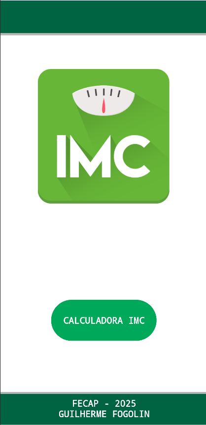
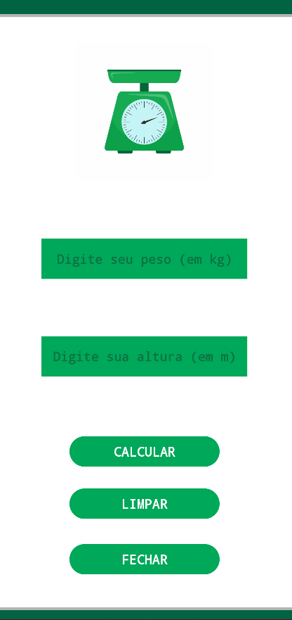
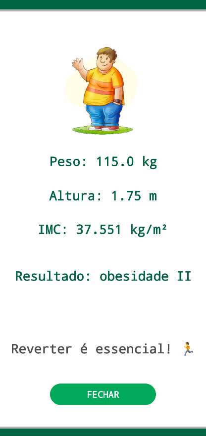

# 📱 Projeto Calculadora para IMC
---

## 🧑‍🔬 Autoria: [Guilherme Reis Fogolin de Godoy](https://www.linkedin.com/in/guilhermefogolin/)

---

## 📄Descrição

✅ Esse projeto visa desenvolver um aplicativo Android, em Java, que calcula o Índice de Massa Corporal (IMC) e exibe um feedback positivo personalizado para cada categoria de IMC. 

⚖️ O aplicativo demonstra o uso de múltiplas Activities, manipulação de imagens, entrada e saída de dados através de PlainText e TextView, e lógica de programação para cálculos e condicionais. 

😎 Além disso, o projeto visa a aplicação de boas práticas de desenvolvimento, a exploração da criatividade e aplicação de uma paleta de cores definida (padrão da [FECAP](https://www.fecap.br))

🏫 A calculadora foi construída como requisito para a Nota Intermediária I da matéria de Programação para Dispositivos Móveis, ministrada pelo [Professor Vinicius Heltai](https://www.linkedin.com/in/vheltai/). FECAP - 2025 - Terceiro semestre de Ciência da Computação.

---

## 📋 Detalhes

⚕️ O usuário, após passar pela tela principal, vai até a tela de preenchimento dos seus dados. Chegando lá, informa o seu PESO (em kg) e sua ALTURA (em m).

🧮 Apertando o botão calcular, é direcionado para a tela com o feedback do seu IMC. Com uso de Intent e Bundle, os dados são transferidos e as seguintes informações impressas: peso, altura, IMC, classificação e mensagem.

🗂️ O cálculo do IMC segue a regra: ` peso / (altura * altura) `.

➗ A classificação do IMC é de acordo com as seguintes categorias:

```
Abaixo do peso: IMC < 18.5

Peso normal: 18.5 <= IMC < 25

Sobrepeso: 25 <= IMC < 30

Obesidade grau I: 30 <= IMC < 35

Obesidade grau II: 35 <= IMC < 40

Obesidade grau III IMC >= 40
```
---

## ⚒️ Ferramentas e Tecnologias 


---

## 💻 Desenvolvimento

🏳️ O projeto segue a estrutura padrão de organização de trabalhos com Android Studio. Cada tela tem a sua classe `Java` e seu arquivo `XML` correspondente.

📁 Para uma melhor organização, há a reutilização de componentes principais de String e Colors, ambos na pasta `values`.

💡 Através de uma estrutura de decisão encadeada `IF-ELSE` cada valor de IMC é analisado e, assim, com a implementação das Intents e Bundles cada tela respectiva é chamada.

🧬 Respeitando o ciclo de vida de uma aplicação mobile, todas as telas têm os respectivos métodos: `onCreate | onStart | onRestart | onResume | onPause | onStop onDestroy`.

---

## 📂 Organização das pastas

🎯Além das pastas comuns para um projeto Mobile com seus códigos fontes, há a pasta `apk` com a versão final do aplicativo e também `pastaZip` com uma versão compactada da Calculadora. 

---

## ⚙️ Como instalar localmente?

1️⃣ Faça o download do arquivo .zip na pasta [pastaZip](./pastaZip).
<br>
2️⃣ Descompacte os arquivos.
<br>
3️⃣ Abra a pasta no Android Studio na versão Ladybug Feature Drop | 2024.2.2.
<br>
4️⃣ Aguarde a instalação das dependências.
<br>
5️⃣ Rode o app e aproveite!

---

## 🤳 Como testar no seu celular Android?

1️⃣ Exporte o arquivo da pasta [apk](./apk) para o seu celular Android (iOS não é suportado).
<br>
2️⃣ Instale o aplicativo pelo próprio sistema.
<br>
3️⃣ Caso indique problemas com vírus e afins pode apertar em confiar.
<br>
4️⃣ Abra o app e conheça todas suas funcionalidades!

## 📸 Exemplos de telas do aplicativo

<p align="center">
  
  
  
  
</p>
